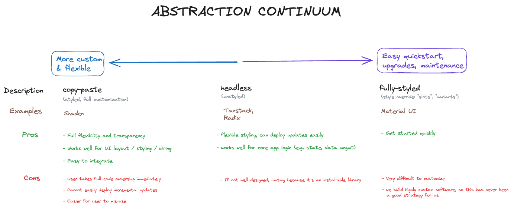

# What is Zoos?

Menu of independent features, methods and libraries provide building blocks for delivering fully customizable _and maintainable_ React applications.

## Using Zoos in your project

1. Integrate the [css variable definitions](https://github.com/ZooHillData/zoos/blob/main/apps/zoos/src/styles.css) into your app's CSS solution
2. Integrate the `theme` attribute from [tailwind.config.js](https://github.com/ZooHillData/zoos/blob/main/apps/zoos/tailwind.config.js) into your app's tailwind config
3. Update `content` in your Tailwind config to include `"node_modules/@zoos/*/index.mjs"`:

## Quickstart

### Local Dev (preferred)

```bash
npm install
```

If using supabase, copy `apps/zoos/.env.example` to `apps/zoos/.env.local` and update environment variables if not using 1Password CLI.

```bash
# Without 1Password CLI
npm run dev

# With `Password CLI
op run --env-file=./apps/zoos/.env.local --no-masking -- npm run dev
```

### Zoos on Netlify

Alternatively, visit the Zoos prod / dev apps:

- prod: https://zoos.zoohilldata.com
- dev: https://dev--zoos-app.netlify.app

## Core problem

How to package re-usable code and methods for use amongst many **_diverse and evolving_** applications?

### Apps served by Zoos:

- are built incrementally. Many times, start small without a full understanding of the final product
- require unique, extremely specific optimizations and UX, branding and styles.
- experiment with new features and patterns rapidly
- are maintained by a very small engineering team (no dedicated support)
- need flexibility to pick-and-choose the methods for their specific use case (feature/library indpendence)

### Picking the right level of abstraction



#### Library Examples at different abstraction levels

- [Copy-and-paste (styled), Shadcn UI](https://ui.shadcn.com/docs/components/accordion)
- [Headless (unstyled), library, Radix UI](https://www.radix-ui.com/primitives)
- [Headless (unstyled), library, Tanstack](https://www.tanstack.com)
- [Fully-styled ibrary, Material UI](https://mui.com/material-ui)

## Introducing Zoos

### No one-size-fits-all solution

- After trying the full spectrum of abstraction levels, we've found there's no 1-size fits all.
- Each core feature will require different abstraction levels (even within the same feature).

### Zoos - an abstraction experiment

Zoos is a centralized collection, or "menu" of building blocks (libraries, copy-paste examples, patterns, philosophies, etc.) that can be used to build enterprise-grade apps efficiently.

Easily pull in completely customizable core features into your app like:

- auth / user management
- forms
- navigation
- dialogs / alerts
- data tables, filtering, aggregation, charts and visualizations
- cloud storage
- sharing, permissions, security, encryption
- realtime collaboration
- ...

## Zoos - Before and After

### Forms - without Zoos

- Manually connect `FormData` to inputs in the UI to modify the data
- Even in the extremely simple case below without inter-field dependencies, validation or dynamic options, there's a lot of boilerplate

```tsx
import { useForm } from "@tanstack/react-form";

const signupOptions = {
  defaultValues: {
    email: "",
    password: "",
    confirmPassword: "",
  },
  handleSubmit: ({ value }) => {
    console.log({ value });
  },
};

const SignupForm = () => {
  const form = useForm(signupOptions);

  return (
    <form
      onSubmit={(e) => {
        e.preventDefault();
        e.stopPropagation();
        form.handleSubmit();
      }}
    >
      <form.Field name="email">
        {(field) => (
          <div>
            <label htmlFor="email">Email</label>
            <input id="email" value={field.state.value} onChange={(e) => field.onChange(e.target.value)} />
          </div>
        )}
      </form.Field>
      <form.Field name="password">
        {(field) => (
          <div>
            <label htmlFor="password">Password</label>
            <input id="password" type="password" value={field.state.value} onChange={(e) => field.onChange(e.target.value)} />
          </div>
        )}
      </form.Field>
      <form.Field name="confirmPassword">
        {(field) => (
          <div>
            <label htmlFor="confirmPassword">Password</label>
            <input id="confirmPassword" type="password" value={field.state.value} onChange={(e) => field.onChange(e.target.value)} />
          </div>
        )}
      </form.Field>
      <button type="submit">Sign Up</button>
    </form>
  );
};
```

### Forms - with Zoos

- Data is parsed, validated and input fields are inferred for you
- You can override field types as needed, e.g.
  - string will default to "string.regular", a standard text input
  - we can override "password" and "confirmPassword" to "string.password" to get a password input with a show/hide toggle

```tsx
import { Form, getFormConfig } from "@zoos/react-form";

const signupConfig = getFormCOnfig({
  defaultValues: {
    email: "",
    password: "",
    confirmPassword: "",
  },
})({
  fields: { password: { type: "string.password" }, confirmPassword: { type: "string.password" } },
});

const SignupForm = () => {
  return <Form config={signupConfig} />;
};
```

### Table - without Zoos

You can see examples on [Tanstack Table docs](https://tanstack.com/table/v8/docs/framework/react/examples/column-dnd)

- Each feature requires careful wiring of application logic, state, styling and event handlers.
- It's very tedious, especially when you combine multiple features together (e.g. row virtualization and drag-and-drop column ordering)

Zoos provides helpers to make wiring in these different features much easier without losing the flexibility to fully customize the implementation details of that feature.

### Table - with Zoos

- Higher level abstraction makes building a full-featured table very fast
- Hardest parts => state / data management are handled
- An opinion for how to style is provided but can be easily overridden or completely taken over and replaced with custom implementation

```tsx
import { getColumns, useTable, useComponentProps, Table } from "@zoos/react-table-ui";

const data: Data[] = getData();

const ZoosTable = () => {
  // Column type inference
  const columns = React.useMemo(() => getColumns({ data })(), []);

  // Standard table state / data management
  const { table, virtualRows, rowVirtualizer, scrollContainerRef } = useTable({
    data,
    columns,
  });

  // Standard styles / props
  // (optional overrides)
  const componentProps = useComponentProps(
    {
      table,
      rowVirtualizer,
      scrollContainerRef,
    },
    {
      // Merge in fully custom styles
      mergeProps: [{ container: { className: "text-sm" } }],
    },
  );

  return <Table {...{ table, virtualRows, coponentProps }} />;
};
```
